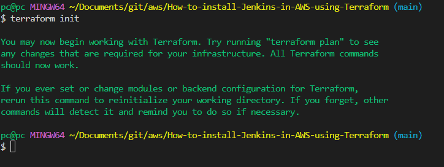
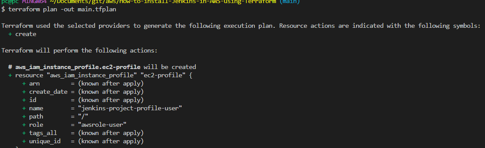
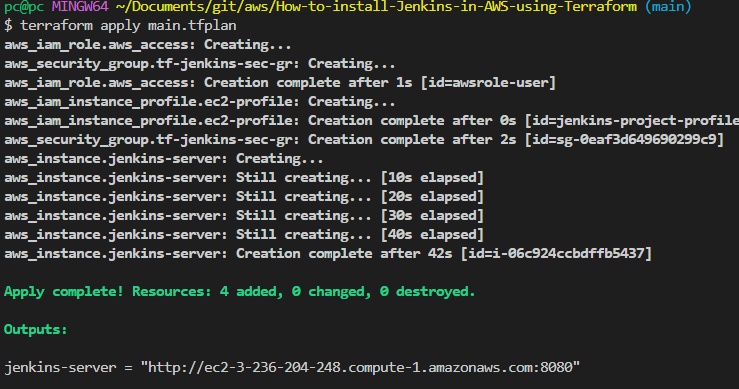
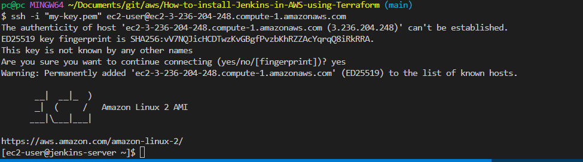
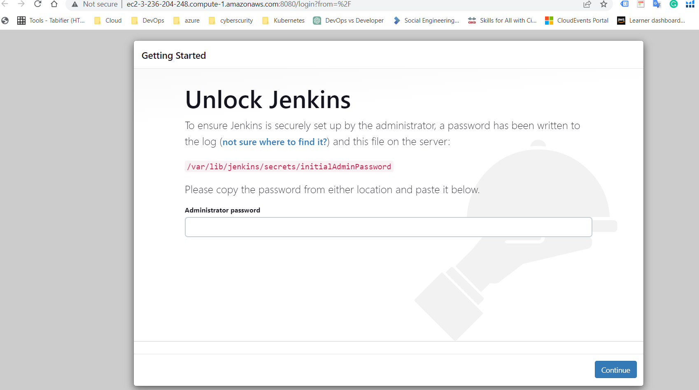
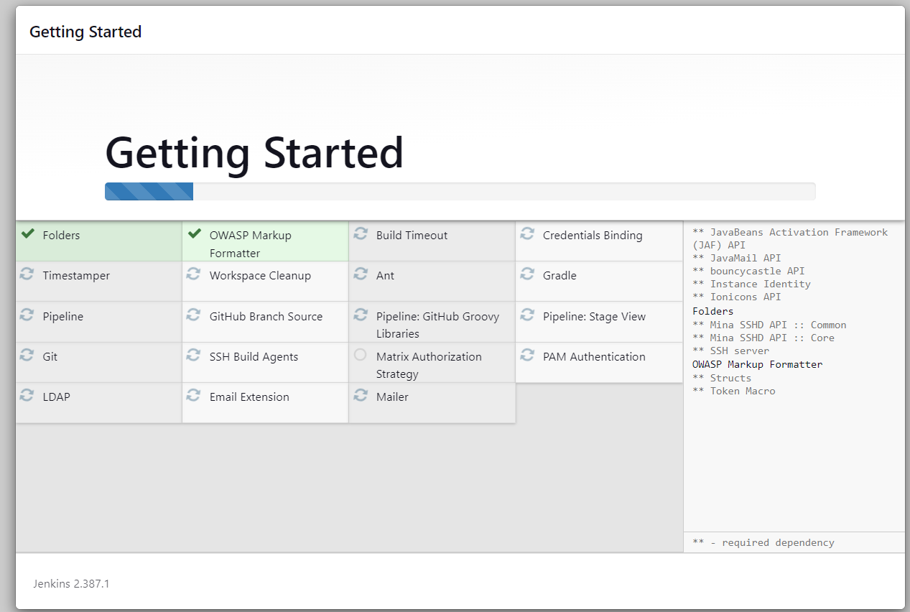
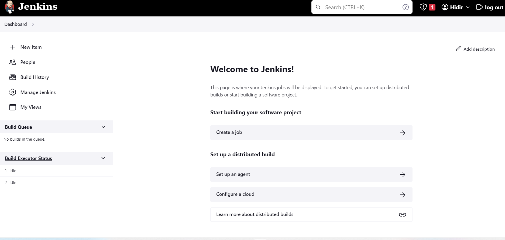

# How-to-install-Jenkins-in-AWS-using-Terraform

### Step 1: Set up AWS credentials
Before you start, you need to set up your AWS credentials. You can do this by creating an IAM user with the appropriate permissions and creating an access key and secret key. Once you have these, you can set them as environment variables or configure the AWS CLI.

### Step 2: Create a Terraform configuration file
Create a new directory.  and create files main.tf and variables.tf.
Create a file Jenkins.sh for installation Jenkins.

### Step 3: Define AWS provider
In your main.tf file, define the AWS provider. This tells Terraform that you will be using AWS as your cloud provider. Next, you will create an EC2 instance that will run Jenkins. Add the following code to your main.tf file:

This code creates an EC2 instance using the ami specified (Amazon Linux 2 in this example) and the instance_type specified (t2.micro in this example). It also specifies a key_name for SSH access and a security_group for network access. Finally, it specifies a user_data script that will be run when the instance is launched. This Jenkins.sh file installs Java and Jenkins, and starts the Jenkins service.

### Step 5: Apply the Terraform configuration
After you have defined your Terraform configuration, you can apply it to create your Jenkins instance. Run the following commands:

`terraform init `

`terraform plan -out main.tfplan`

`terraform apply main.tfplan`

Terraform will initialize and apply your configuration. Once it's finished, it will output the public IP address of your new EC2 instance.

### Step 6: Access Jenkins
To access Jenkins, open a web browser and go to the public IP address of your EC2 instance on port 8080. For example: http://<public-ip>:8080.

### Step 7: Set up Jenkins
Once you have accessed Jenkins, you will need to follow the setup wizard to configure Jenkins. You will be asked to create an admin user and choose your plugins. You can choose the plugins you want or skip this step and install them later.

To install Jenkins, an admin password is required, we will connect to  EC2 and  get the password.

`ssh -i "my-key.pem" ec2-user@ec2-3-236-204-248.compute-1.amazonaws.com` example  code 

After EC2 is connected, we run the following code in the terminal and open the password in the editor.

Let's copy this password and throw it on the setup screen and start the installation.

`sudo nano /var/lib/jenkins/secrets/initialAdminPassword`

Create First Admin User and complete the first setup

